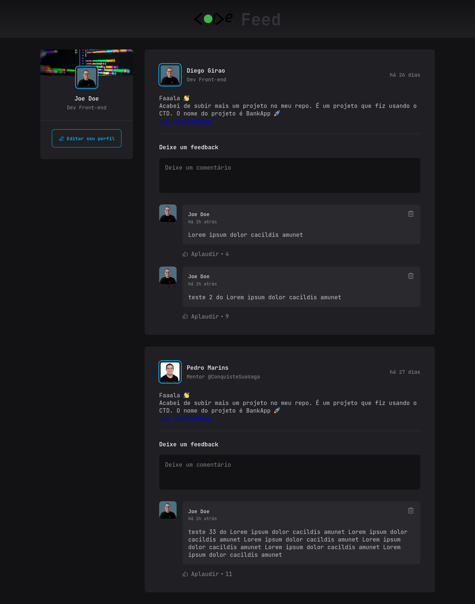

 

# Feed de comentários da comunidade code

 

 

 

Este foi o terceiro projeto da mentoria **Conquiste Sua Vaga** , foi inspirado na Rocketseat, pude exercitar algumas habilidades de Front-end utilizando o react e algumas de suas funções básicas até intermediárias.

## Sumário

- [Overview](#overview)
  - [O Desafio](#O-Desafio)
  - [Screenshot](#screenshot)
- [Meu processo](#Meu-processo)
  - [Stacks utilizadas](#Stacks-utilizadas)
  - [O que aprendi](#O-que-aprendi)
  - [Desenvolvimento Contínuo](#Desenvolvimento-Contínuo)
- [Author](#author)
- [Agradecimentos](#Agradecimentos)

## Overview

### O Desafio

- O desafio era criar um feed de comentários onde os usuários da plataforma poderiam interagir com mensagens, links de projetos e curtir os comentários

- Ver o layout ideal para a interface, dependendo do tamanho da tela do dispositivo

- Ver o hover e focus para todos os elementos interativos na página, alterando suas cores, bordas e margens

 

### **Screenshot - Desktop**

 

### **Screenshot - Mobile**

## Meu processo

- Selecionar o projeto a ser realizado

- Após selecionar o projeto, optei por utilizar _HTML5, CSS Modules, React, Vite e JavaScript_, otimizando assim o desenvolvimento da aplicação

- Foram realizados alguns wireframes de como seria toda a estrutura do projeto

- Iniciar o desenvolvimento do código na seguinte ordem, html, css e por último as funcionalidades javascript + react

### Stacks utilizadas

      

- [x] HTML5 Semântico
- [x] CSS Module | CSS Flexbox | CSS Grid
- [x] JavaScript
- [x] React
- [x] Vite

### O que aprendi

- Aprendi uma nova forma de implementar CSS, utilizando o CSS Modules, além de relembrar a utilização da lib date-fns para formatar a data dos posts

- Combinar CSS Grid e Flexbox

- Uma grande melhoria na gestão desse projeto ao utilizar o método pomodoro

- Refatorando e usando useState, props e o conceito de imutabilidade, além de fixar melhor o conceito de programação declarativa.

- Organizar os componentes e seus estilos nas suas respectivas pastas.

### Desenvolvimento Contínuo

Algumas melhorias já estão mapeadas para próxima release, são as seguintes:

- [x] Implementar as funções de alguns componentes que ficaram estáticos
- [ ] Utilizar o Styled Components - Em análise

## Author - Diego Girão

 

## Agradecimentos

Meu muito obrigado aos mentores **Pedro Marins e Henrique Andrade**, assim como os tutores e meus colegas da turma 23C e da comunidade **Code** no geral, vocês são excelentes e estão sempre dispostos a ajudar, parabéns a todos os envolvidos.
